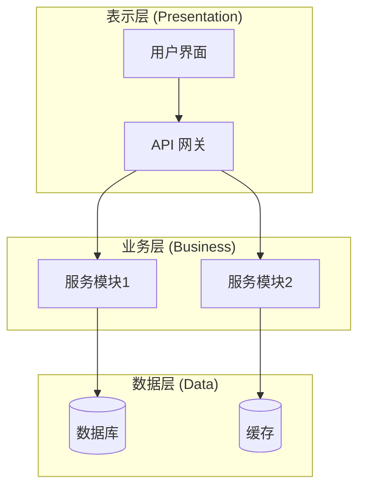
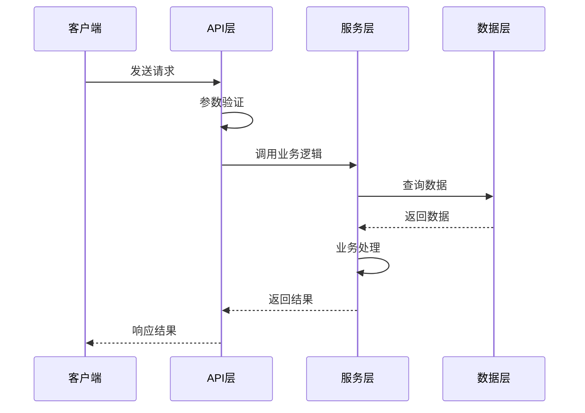
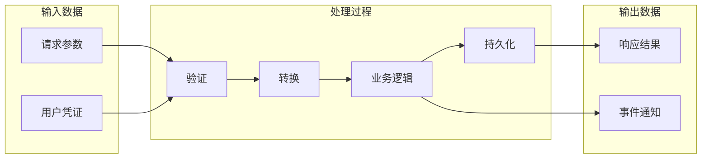

# 项目分析技能

本技能提供两种分析模式，帮助理解和可视化代码库结构。

## 分析模式

### 模式一：系统架构分析

从宏观层面分析项目，生成整体架构视图。

**分析步骤：**

1. **识别项目类型和技术栈**
   - 检查配置文件：`package.json`, `pyproject.toml`, `Cargo.toml`, `go.mod`, `pom.xml` 等
   - 识别框架：React, Vue, Django, FastAPI, Spring Boot 等
   - 识别构建工具和依赖管理器

2. **分析目录结构**
   - 使用 Glob 扫描主要目录
   - 识别分层模式：controllers, services, models, utils 等
   - 标注入口文件和配置文件

3. **提取核心模块**
   - 识别主要功能模块
   - 分析模块间的依赖关系
   - 识别外部服务依赖（数据库、缓存、消息队列等）

4. **生成架构图**

**输出格式（Mermaid C4 架构图）：**



**架构图模板选择：**

- **分层架构**：适用于传统 MVC、三层架构项目
- **微服务架构**：适用于多服务、分布式系统
- **前后端分离**：适用于 SPA + API 项目
- **单体应用**：适用于小型项目

---

### 模式二：模块数据流分析

深入分析特定模块或功能的数据流转过程。

**分析步骤：**

1. **确定分析目标**
   - 明确要分析的功能或模块
   - 识别入口点（API 端点、事件处理器、命令入口）

2. **追踪代码调用链**
   - 从入口点开始追踪函数调用
   - 记录数据在各层之间的转换
   - 标注关键的数据处理节点

3. **识别数据模型**
   - 分析输入数据结构
   - 追踪数据变换过程
   - 记录输出数据结构

4. **生成时序图和数据流图**

**时序图输出格式（Mermaid Sequence Diagram）：**



**数据流图输出格式（Mermaid Flowchart）：**



---

## 使用指南

### 执行系统架构分析

1. 使用 Glob 扫描项目根目录，识别配置文件
2. 分析目录结构，识别主要模块
3. 使用 Grep 搜索 import/require 语句分析依赖
4. 综合分析后生成 Mermaid 架构图
5. 用中文标注各模块的职责
6. 使用 `mermaid-live-preview` 编码脚本为每个 Mermaid 图生成在线预览链接

### 执行模块数据流分析

1. 确认用户想分析的具体模块或功能
2. 定位入口文件和入口函数
3. 逐层追踪函数调用，使用 Read 工具查看代码
4. 记录每个步骤的数据变化
5. 生成时序图和数据流图
6. 用中文描述关键数据流转节点
7. 使用 `mermaid-live-preview` 编码脚本为每个 Mermaid 图生成在线预览链接

---

## 输出规范

### 架构分析报告结构

```markdown
## 项目概述
- 项目名称
- 技术栈
- 项目类型

## 目录结构
- 主要目录说明

## 架构图
[Mermaid 图]

## 核心模块说明
| 模块名称 | 职责 | 依赖 |
|---------|------|------|
| ... | ... | ... |

## 外部依赖
- 数据库
- 第三方服务
```

### 数据流分析报告结构

```markdown
## 分析目标
- 功能/模块名称
- 入口点

## 时序图
[Mermaid 时序图]

## 数据流图
[Mermaid 流程图]

## 关键节点说明
| 节点 | 文件位置 | 数据变换 |
|-----|---------|---------|
| ... | ... | ... |

## 数据模型
- 输入结构
- 输出结构
```

---

## 文档输出流程

分析完成后，将结果保存到项目的 `docs/` 目录。

### 输出步骤

1. **检查 docs 目录**
   - 如果 `docs/` 目录不存在，创建该目录
   - 检查是否有现有的架构文档，避免覆盖

2. **确定文件名**
   - 架构分析：`docs/architecture.md`
   - 数据流分析：`docs/dataflow-{模块名}.md`
   - 如用户指定文件名，使用用户指定的名称

3. **写入文档**
   - 使用 Write 工具将分析报告写入目标文件
   - 文档头部添加生成时间和分析范围说明

4. **生成在线预览链接**
   - 对每个生成的 Mermaid 图表，使用 `mermaid-live-preview` skill 的编码脚本生成在线预览链接：
     ```bash
     python3 <skills-root>/skills/mermaid-live-preview/scripts/encode.py "<mermaid代码>"
     ```
   - 将输出的 Edit 和 View 链接附加在对应 Mermaid 代码块之后
   - 格式示例：
     ```markdown
     [在线编辑](https://mermaid.live/edit#pako:...) | [在线预览](https://mermaid.live/view#pako:...)
     ```

5. **确认输出**
   - 告知用户文档已保存的路径
   - 附带在线预览链接，用户可直接点击查看图表

### 文档模板

**架构文档 (`docs/architecture.md`)：**

```markdown
# 项目架构文档

> 生成时间：YYYY-MM-DD
> 分析范围：全项目

## 项目概述
...

## 架构图
...

[在线编辑](edit-url) | [在线预览](view-url)

## 模块说明
...
```

**数据流文档 (`docs/dataflow-{模块名}.md`)：**

```markdown
# {模块名} 数据流分析

> 生成时间：YYYY-MM-DD
> 分析模块：{模块路径}

## 时序图
...

[在线编辑](edit-url) | [在线预览](view-url)

## 数据流图
...

[在线编辑](edit-url) | [在线预览](view-url)

## 节点说明
...
```

### 文件命名规范

| 分析类型 | 文件名格式 | 示例 |
|---------|-----------|------|
| 系统架构 | `architecture.md` | `docs/architecture.md` |
| 模块架构 | `architecture-{模块}.md` | `docs/architecture-auth.md` |
| 数据流 | `dataflow-{功能}.md` | `docs/dataflow-login.md` |
| 时序图 | `sequence-{流程}.md` | `docs/sequence-order-create.md` |

---

## 最佳实践

- 优先使用项目已有的文档（README、API 文档）作为参考
- 架构图保持简洁，避免过于细节
- 时序图聚焦主流程，分支逻辑可单独说明
- 所有图表使用中文标注
- 为每个模块提供简短的职责说明
- 每个 Mermaid 图表输出后，必须附带在线预览链接（使用 `mermaid-live-preview` skill 的 `encode.py`）
- 分析完成后始终将结果保存到 `docs/` 目录
- 更新现有文档时保留历史版本或做增量更新
