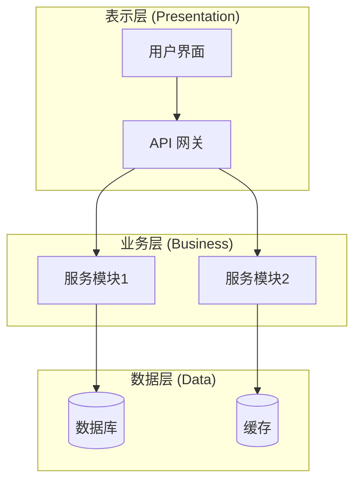

# 模式一：系统架构分析

从宏观层面分析项目，生成整体架构视图。

## 分析步骤

### 1. 识别项目类型和技术栈
- 检查配置文件：`package.json`, `pyproject.toml`, `Cargo.toml`, `go.mod`, `pom.xml` 等
- 识别框架：React, Vue, Django, FastAPI, Spring Boot 等
- 识别构建工具和依赖管理器

### 2. 分析目录结构
- 使用 Glob 扫描主要目录
- 识别分层模式：controllers, services, models, utils 等
- 标注入口文件和配置文件

### 3. 提取核心模块
- 识别主要功能模块
- 分析模块间的依赖关系
- 识别外部服务依赖（数据库、缓存、消息队列等）

### 4. 生成架构图

**输出格式（Mermaid C4 架构图）：**

## 架构图模板选择

- **分层架构**：适用于传统 MVC、三层架构项目
- **微服务架构**：适用于多服务、分布式系统
- **前后端分离**：适用于 SPA + API 项目
- **单体应用**：适用于小型项目

> 详细模板参考 `references/mermaid-templates.md` 中的架构图模板部分。

## 执行指南

1. 使用 Glob 扫描项目根目录，识别配置文件
2. 分析目录结构，识别主要模块
3. 使用 Grep 搜索 import/require 语句分析依赖
4. 综合分析后生成 Mermaid 架构图
5. 立即为该 Mermaid 架构图补充等价的 ASCII/TUI 预览图
6. 用中文标注各模块的职责
7. 输出时同时保留 Mermaid 与 ASCII/TUI 两种视图，便于用户审查
