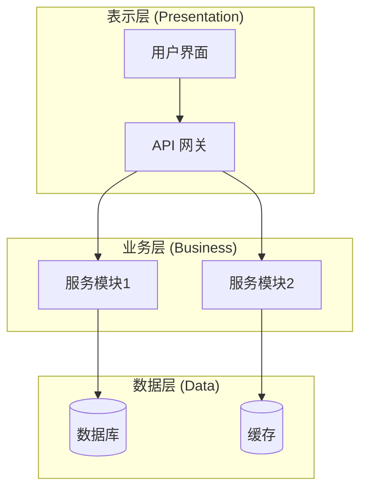

# 模式一：系统架构分析

从宏观层面分析项目，生成整体架构视图。

## 分析步骤

### 1. 识别项目类型和技术栈
- 检查配置文件：`package.json`, `pyproject.toml`, `Cargo.toml`, `go.mod`, `pom.xml` 等
- 识别框架：React, Vue, Django, FastAPI, Spring Boot 等
- 识别构建工具和依赖管理器

### 2. 拆分并行子任务

建议优先拆成以下 3 个并行子任务：
- **子任务 A：技术栈与入口点**
  - 识别运行时、框架、构建工具、主入口文件、关键配置文件
- **子任务 B：目录结构与模块边界**
  - 扫描主要目录，梳理模块职责、分层边界、核心目录
- **子任务 C：依赖关系与外部服务**
  - 识别模块间依赖、数据库、缓存、队列、第三方服务与基础设施

如项目较小，可合并为 2 个子任务；如项目较复杂，可扩展到 4 个，但应保持任务独立。

### 3. 分析目录结构
- 使用 Glob 扫描主要目录
- 识别分层模式：controllers, services, models, utils 等
- 标注入口文件和配置文件

### 4. 提取核心模块
- 识别主要功能模块
- 分析模块间的依赖关系
- 识别外部服务依赖（数据库、缓存、消息队列等）

### 5. 生成架构图

**输出格式（Mermaid C4 架构图）：**

## 架构图模板选择

- **分层架构**：适用于传统 MVC、三层架构项目
- **微服务架构**：适用于多服务、分布式系统
- **前后端分离**：适用于 SPA + API 项目
- **单体应用**：适用于小型项目

> 详细模板参考 `references/mermaid-templates.md` 中的架构图模板部分。

## SubAgent 执行要求

下发并行子任务时，要求每个 subagent 返回结构化结果，至少包括：
- 分析范围
- 关键文件路径
- 发现的模块 / 服务 / 入口点
- 依赖关系或外部服务
- 需要主 agent 复核的疑点

subagent 只负责读代码和整理事实，不负责写最终报告。

## 执行指南

1. 使用 metadata 扫描脚本检查是否已有高相似度文档
2. 如发现相似文档，先让用户选择 `patch / overwrite / cancel`
3. 使用 Agent 工具将系统架构分析拆成 2-4 个只读子任务并行执行
4. 汇总技术栈、目录结构、模块边界、依赖关系和外部服务
5. 综合分析后生成 Mermaid 架构图
6. 立即为该 Mermaid 架构图补充等价的 ASCII/TUI 预览图
7. 用中文标注各模块的职责
8. 先 review，再按用户选择执行 new / patch / overwrite
9. 向用户汇报文档路径、操作类型和关键发现
