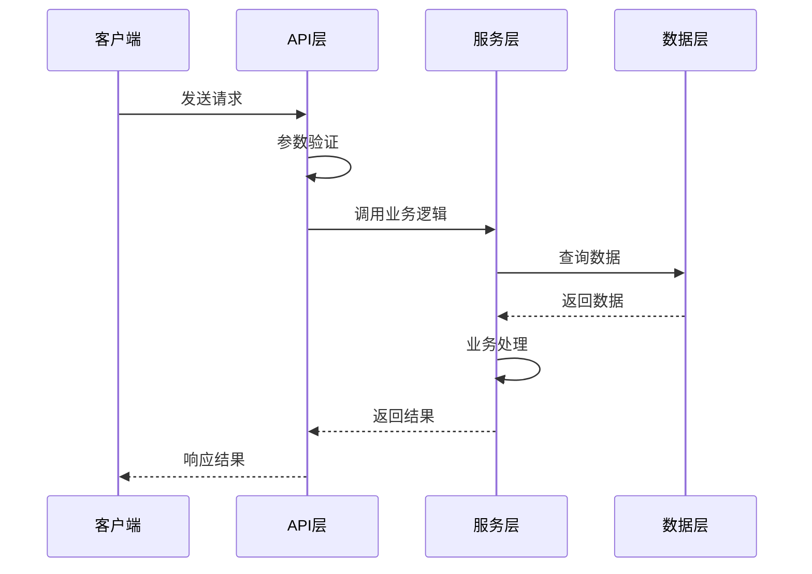
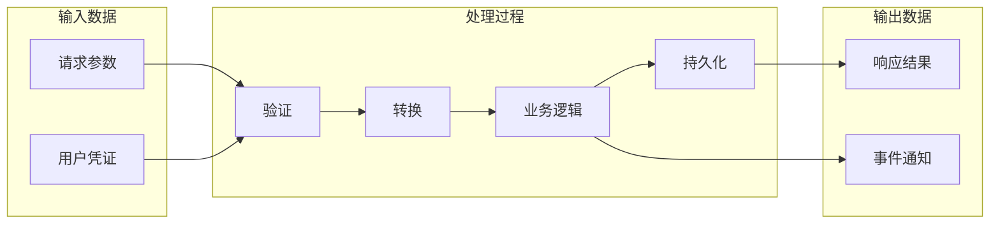

# 模式二：模块数据流分析

深入分析特定模块或功能的数据流转过程。

## 分析步骤

### 1. 确定分析目标
- 明确要分析的功能或模块
- 识别入口点（API 端点、事件处理器、命令入口）

### 2. 追踪代码调用链
- 从入口点开始追踪函数调用
- 记录数据在各层之间的转换
- 标注关键的数据处理节点

### 3. 识别数据模型
- 分析输入数据结构
- 追踪数据变换过程
- 记录输出数据结构

### 4. 生成时序图和数据流图

**时序图输出格式（Mermaid Sequence Diagram）：**

**数据流图输出格式（Mermaid Flowchart）：**

> 详细模板参考 `references/mermaid-templates.md` 中的时序图和数据流图模板部分。

## 执行指南

1. 确认用户想分析的具体模块或功能
2. 定位入口文件和入口函数
3. 逐层追踪函数调用，使用 Read 工具查看代码
4. 记录每个步骤的数据变化
5. 生成时序图和数据流图
6. 用中文描述关键数据流转节点
7. 可选绘制 TUI ASCII 预览图，帮助用户在终端里快速查看主要流转路径
