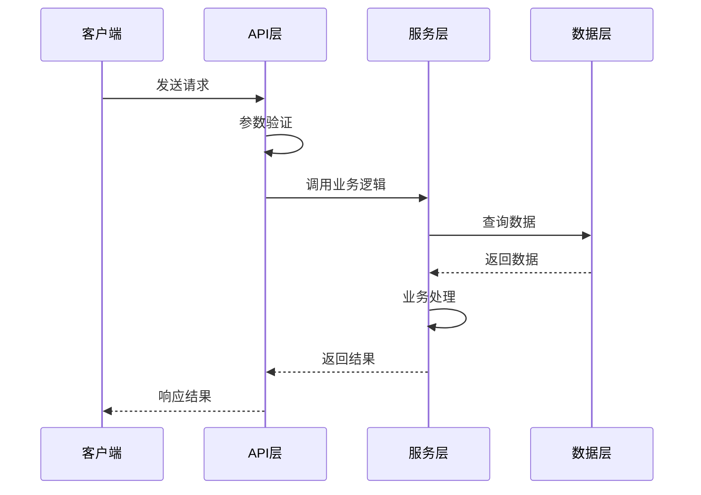
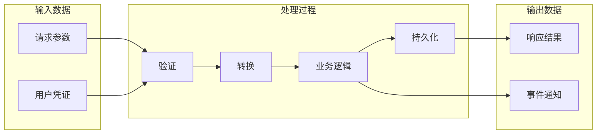

# 模式二：模块数据流分析

深入分析特定模块或功能的数据流转过程。

## 分析步骤

### 1. 确定分析目标
- 明确要分析的功能或模块
- 识别入口点（API 端点、事件处理器、命令入口）

### 2. 拆分并行子任务

建议优先拆成以下 3 个并行子任务：
- **子任务 A：入口点与边界定位**
  - 找到入口文件、入口函数、请求/事件来源、主要边界条件
- **子任务 B：调用链与关键处理节点**
  - 追踪从入口到核心业务逻辑的调用链，记录关键函数与跨层跳转
- **子任务 C：数据模型与外部 I/O**
  - 提取输入结构、输出结构、持久化、缓存、消息、第三方 API 交互

如流程非常短，可合并为 2 个子任务；如链路特别复杂，可加一个“异常/分支流程”子任务。

### 3. 追踪代码调用链
- 从入口点开始追踪函数调用
- 记录数据在各层之间的转换
- 标注关键的数据处理节点

### 4. 识别数据模型
- 分析输入数据结构
- 追踪数据变换过程
- 记录输出数据结构

### 5. 生成时序图和数据流图

**时序图输出格式（Mermaid Sequence Diagram）：**

**数据流图输出格式（Mermaid Flowchart）：**

> 详细模板参考 `references/mermaid-templates.md` 中的时序图和数据流图模板部分。

## SubAgent 执行要求

下发并行子任务时，要求每个 subagent 返回结构化结果，至少包括：
- 入口点与触发方式
- 关键调用链（按顺序列出）
- 关键数据结构 / 参数 / 返回值
- 外部 I/O（数据库、缓存、消息、第三方服务）
- 需要主 agent 复核的疑点或分支

subagent 只负责事实提取与链路梳理，不直接写最终文档。

## 执行指南

1. 使用 metadata 扫描脚本检查是否已有高相似度文档
2. 如发现相似文档，先让用户选择 `patch / overwrite / cancel`
3. 确认用户想分析的具体模块或功能
4. 使用 Agent 工具将数据流分析拆成 2-4 个只读子任务并行执行
5. 汇总入口点、调用链、数据结构、外部 I/O 与关键节点
6. 生成时序图和数据流图
7. 为每张 Mermaid 图补充对应的 ASCII/TUI 预览图
8. 用中文描述关键数据流转节点
9. 先 review，再按用户选择执行 new / patch / overwrite
10. 向用户汇报文档路径、操作类型和关键发现
